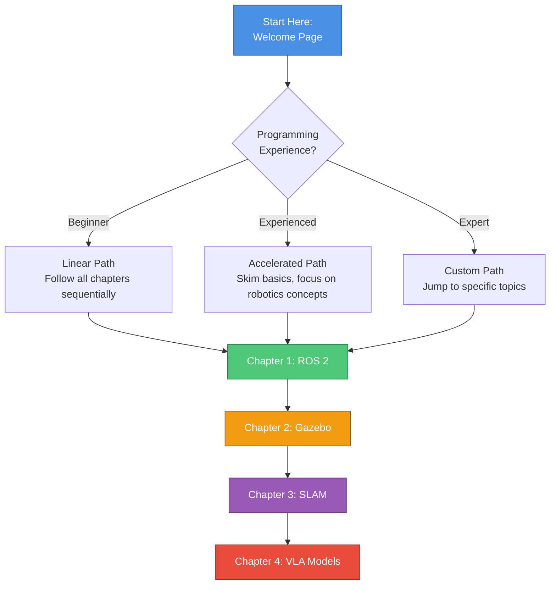

# ⚙️ The Iron Requirements

The ambition of Physical AI, unlike its purely digital counterpart, demands a foundational integrity rooted in uncompromising hardware. Our journey into embodied intelligence necessitates an infrastructure that is not merely robust, but rigorously specified to endure the **Three Heavy Loads**:

1. 🧠 **Real-time Perception**: Immense computational burden of processing sensor data
2. 🔄 **Digital Twin Simulation**: Iterative demands of high-fidelity virtual environments
3. ⚡ **Physical Interaction**: Critical low-latency requirements for robot control

This is not a suggestion; it is a mandate.

> [!WARNING]
> **Digital Twin Workstation Specifications (Mandatory)**
> 
> The core of our development ecosystem is the **Digital Twin Workstation**. This is not a mere development machine, but the crucible where virtual and physical realities converge.
> 
> **Minimum Specifications**:
> - **RAM**: 64GB (non-negotiable) for complex simulation environments and sensor data streams
> - **OS**: Ubuntu 22.04 LTS (stability, community support, AI/ML framework integration)
> - **GPU**: NVIDIA RTX 3060+ or equivalent (CUDA-capable for ML inference)
> - **Storage**: 500GB SSD minimum (simulation environments are large)
> - **CPU**: 8+ cores (Intel i7/i9 or AMD Ryzen 7/9)
> 
> This standardized environment ensures deterministic behavior and reproducibility across all development efforts, eliminating the vagaries of disparate setups.

> [!WARNING]
> **Edge Kit Specifications (Mandatory)**
> 
> Complementing the workstation is the **Edge Kit**, purpose-built for real-world interaction and data acquisition.
> 
> **Required Components**:
> - **Intel RealSense Depth Cameras**: High-resolution, low-latency 3D perception for spatial understanding
> - **NVIDIA Jetson Platform**: Accelerated inference for executing AI models at the edge
> - **IMU Sensors**: Inertial measurement for state estimation
> - **Robot Platform**: TurtleBot 4, mobile manipulator, or equivalent ROS 2-compatible hardware

> [!NOTE]
> Deviation from these specifications introduces unacceptable risk into the system's performance, stability, and ultimately, its capacity for intelligent action. The iron requirements are the bedrock upon which the edifice of Physical AI is built.

---

## 🎯 What You'll Learn

This is an AI-native book, meaning it's designed to be:

### 🔄 Interactive & Hands-On
- **Simulation-First**: Every concept is practiced in safe virtual environments before hardware
- **Code Examples**: Production-quality Python and C++ that you can run immediately
- **Progressive Complexity**: From simple turtles to autonomous navigation systems
- **Real-World Projects**: Capstone projects that mirror industry challenges

### 📚 Comprehensive Coverage

#### **Theory & Practice**
- Core robotics concepts (kinematics, dynamics, control theory)
- Modern AI techniques (vision, language models, reinforcement learning)
- Industry standards and best practices
- Safety protocols and ethical frameworks

#### **Technology Stack**
- **ROS 2 Humble**: Industry-standard robotics middleware
- **Gazebo & Isaac Sim**: Physics simulation and digital twins
- **Python & C++**: Primary development languages
- **AI/ML Frameworks**: PyTorch, TensorFlow, ONNX for model deployment

### 🌐 Up-to-Date & Production-Ready
- Continuously updated with latest AI developments
- Based on technologies used by Waymo, Boston Dynamics, NVIDIA, Tesla
- Focus on deployed systems, not research prototypes
- Real-world safety considerations and testing methodologies

### 🚪 Accessible Yet Rigorous
- Clear explanations without sacrificing technical depth
- Visual diagrams and interactive examples
- Self-assessment checkpoints throughout
- Multiple learning paths (beginner, accelerated, self-paced)

---

## 🧭 How to Use This Book

### 📖 Navigation Features

- **📁 Sidebar Navigation**: Browse chapters and sections using the left sidebar
- **🔍 Search Function**: Find specific topics instantly with the search bar
- **🔗 Cross-References**: Linked concepts connect related material throughout the book
- **✅ Progress Tracking**: Self-assessment checklists mark your progress
- **💬 AI Collaboration Prompts**: Suggested questions to ask your AI assistant for deeper understanding

### 🎓 Learning Paths

<b>🟢 Beginner Path (Recommended for Most Learners)</b>

**Prerequisites**: Basic Python knowledge, comfortable with terminal commands

**Timeline**: 40-50 hours total

1. Start with Chapter 1, Lesson 1 (concepts only)
2. Complete all setup and installation steps carefully
3. Work through every code example
4. Complete all self-assessment checklists
5. Finish capstone projects before moving to next chapter

**Best for**: Students, career changers, developers new to robotics

<b>🟡 Accelerated Path (For Experienced Developers)</b>

**Prerequisites**: Strong programming background, understanding of distributed systems

**Timeline**: 20-30 hours total

1. Skim conceptual introductions (10 min per lesson)
2. Focus on robotics-specific content (ROS 2 architecture, message passing)
3. Run code examples to verify understanding
4. Skip basic troubleshooting, use AI assistant for gaps
5. Complete capstone projects to validate mastery

**Best for**: Software engineers, CS graduates, embedded systems developers

<b>🔴 Expert Path (Self-Directed)</b>

**Prerequisites**: Prior robotics experience or ROS 1 background

**Timeline**: 10-15 hours to fill gaps

1. Jump directly to topics of interest
2. Use search function to find specific implementations
3. Reference ROS 2 migration guides if coming from ROS 1
4. Focus on advanced topics (VLA models, production deployment)
5. Contribute back: report issues, suggest improvements

**Best for**: Robotics professionals, researchers, graduate students

---

**Previous**: [Introduction](./01-introduction.md) | **Next**: [Getting Started](./03-getting-started.md) →
