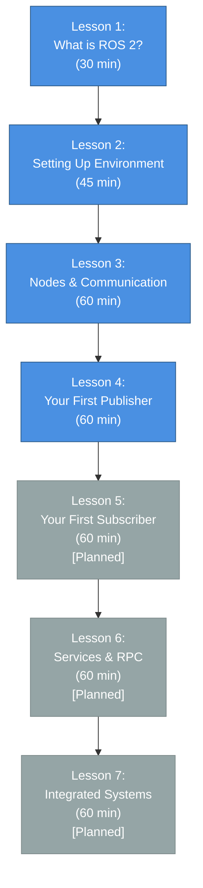

# Chapter 1: ROS 2 Fundamentals & Communication

> **"ROS 2 is the foundation upon which all modern robotics systems are built. Master it, and you unlock the entire robotics ecosystem."**

---

## 📋 Chapter Overview

| **Attribute** | **Details** |
|---------------|-------------|
| **Chapter Number** | 1 |
| **Total Lessons** | 7 |
| **Completed Lessons** | 4 (MVP) |
| **Target Hours** | 5.5 hours |
| **CEFR Entry Level** | A2 (Beginner) |
| **CEFR Exit Level** | B1 (Elementary) |
| **Simulation Environment** | Turtlesim |
| **Safety Level** | Simulation Only |

---

## 🎯 Chapter Objectives

By the end of this chapter, you will be able to:

- ✅ **Understand ROS 2 architecture** (nodes, topics, messages)
- ✅ **Set up a ROS 2 development environment** on Ubuntu 22.04
- ✅ **Create publisher and subscriber nodes** in Python
- ✅ **Implement publish-subscribe communication patterns**
- ✅ **Use ROS 2 CLI tools** for system inspection and debugging
- ✅ **Handle messages asynchronously** and design data flows
- ✅ **Understand service-based synchronous communication**

---

## 🚀 What You'll Learn in This Chapter

The Robot Operating System 2 (ROS 2) is the **de facto standard for robotics development**. Companies like Waymo, Boston Dynamics, and NVIDIA all use ROS 2 as their robotics middleware.

In this chapter, you'll build a **complete mental model** of how ROS 2 systems work.

### 📚 Lesson Breakdown

### Detailed Lesson Descriptions

#### ✅ Lesson 1: What is ROS 2? (30 min)
**Concepts, architecture, why it matters**

- ROS 2 definition and history (why ROS 2 replaced ROS 1)
- Middleware architecture (nodes, topics, messages)
- Three communication patterns (pub/sub, services, actions)
- Why simulation-first is essential
- Real-world robotics companies using ROS 2

**CEFR Target**: A2 (Beginner) — Conceptual foundations

#### ✅ Lesson 2: Setting Up Your ROS 2 Environment (45 min)
**Ubuntu 22.04, installation, Turtlesim**

- Install ROS 2 Humble on Ubuntu 22.04
- Verify installation with `ros2 --version`
- Launch Turtlesim simulator
- Control the turtle with keyboard
- Understand environment variables

**Success Criteria**: Turtle moves when you press 'w/a/s/d'

#### ✅ Lesson 3: Nodes and Communication Patterns (60 min)
**Pub/sub vs. services**

- Node lifecycle and communication
- Publish-subscribe (asynchronous, many-to-many)
- Services (synchronous, request-response)
- Message types and strong typing
- CLI tools: `ros2 node`, `ros2 topic`, `rqt_graph`

**Hands-On**: Inspect live Turtlesim system

#### ✅ Lesson 4: Your First ROS 2 Publisher (60 min)
**Write code, make the turtle move**

- Build a Python ROS 2 node
- Publishers with `create_publisher()`
- Timer callbacks for periodic messages
- Package structure

**Success Criteria**: Write code that makes the turtle move

#### 📝 Lessons 5-7 (Planned)
- Lesson 5: Your First Subscriber
- Lesson 6: Services and Request-Response
- Lesson 7: Building Integrated Systems

---

## 🎓 Chapter Progress

### ✅ Completed (MVP): Lessons 1-4
**User Stories 1-2, estimated 3 hours**

- Understanding ROS 2 architecture ✓
- Setting up your development environment ✓
- Creating your first publisher ✓

### 📋 Planned: Lessons 5-7
**User Story 3, estimated 2.5 hours**

- Subscribers and callbacks
- Services and RPCs
- Multi-node systems

---

**Next**: [Learning Approach](./02-learning-approach.md) →
